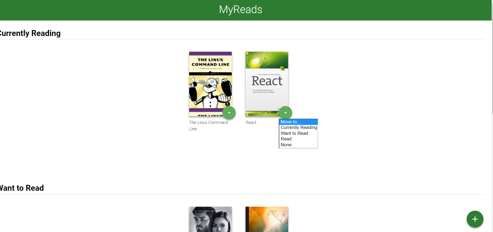
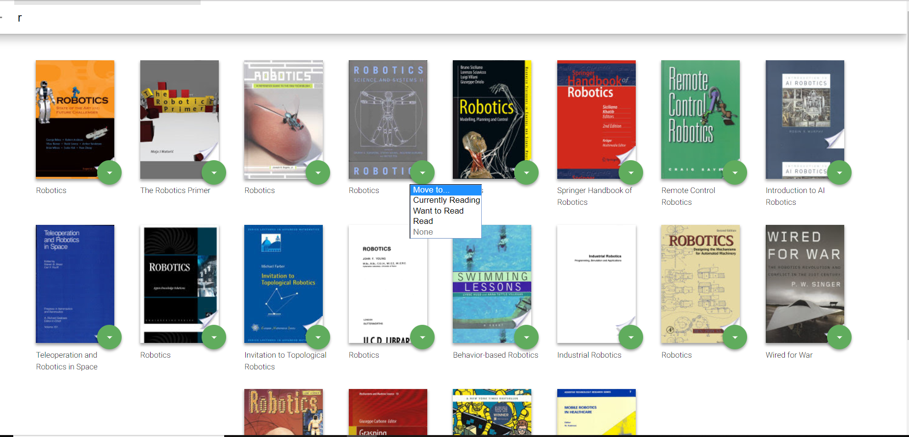

# MyReads App
It is your personal library  where you can put your favorite books in three different shelves- 'Currently Reading', 'Want To Read' and 'Read'.
## Parts of the App
1. Three shelves - Currently Reading, Want To Read, Read.
2. 'Add Book' button.
3. Back Button.
4. Dropdown menu with each book.
5. Search Box
## Page1

## Page2

## How to use the app?
1. There are three shelves in the app and there are some books available in these shelves by default.
2. User can move the books between these three shelves.
3. If you want to add new books to your BookShelf then you can go to 'Add Book' Page and search for your favorite books.
4. You can add your favorite books to the shelf you want.
5. By default, the selected icon is at 'Move to ...' option.  
## Author
Manpreet kaur